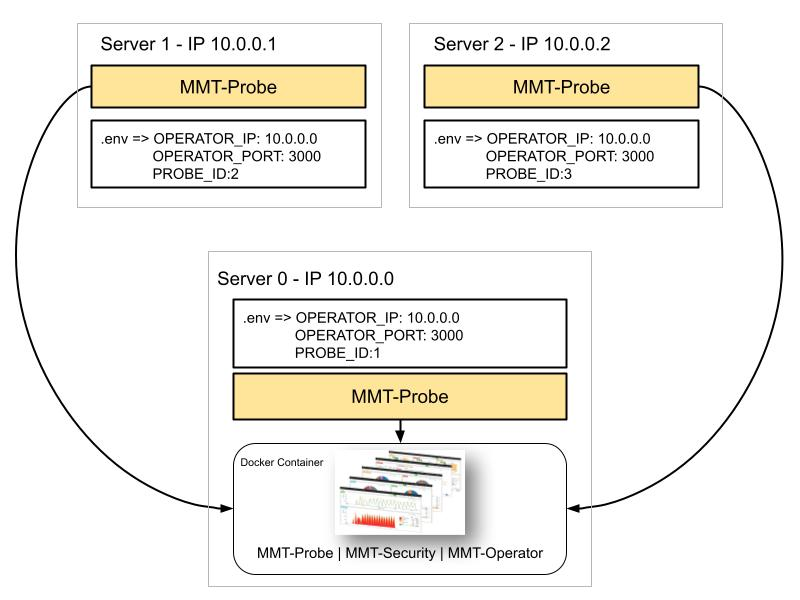

# Setting up MMT-TOOLS and API

For easily setting up multiple MMT-Probes using the same MMT-Operator the following docker compose files were created: only_probe.yml and operator_probe.yml.



Using the following scenario:

* Server 0: will host MMT-Operator and a MMT-Probe. Don't forget to set up the .env file to have OPERATOR_IP = Server 0's IP and the desired PORT for MMT-Operator.

Run the following command:

```bash
  sudo docker compose -f operator_probe.yml -d
```

* Server 1: will host only a MMT-Probe.
* Server 2: will host only a MMT-Probe.

For those servers, set the .env file using the OPERATOR_IP = Server 0's IP (as it will receive the data) and the MMT-Operator's PORT. Also, don't forget to change the PROBE_ID (a different one for each server) so it is possible to see their output in MMT-Operator. 

For setting up the other servers (with only MMT-Probe), run:
```bash
  sudo docker compose -f only_probe.yml up -d
```

The API for remote configuration of MMT-Probe will be listening to port 4000, and it's responsible for making changes in the MMT-Probe docker.

