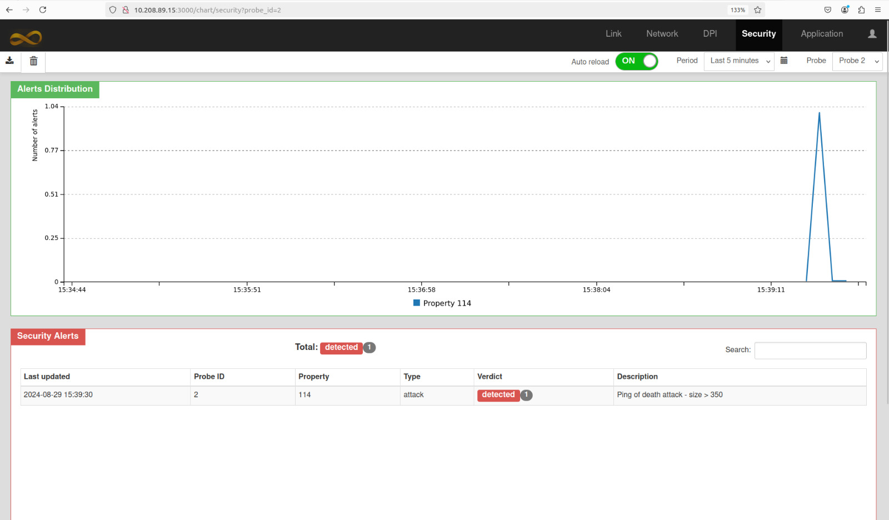

# mmt-mspl-enabler

This project develops a plugin, a Driver and an API to connect a MSPL Policy agent and the mmt-tools installed in a server, making it possible to use .xml policy files to generate new security rules to be used by the MMT-Tools.

Here is an overview of how this project works:


By passing a MSPL Policy File to the mmt-mspl-plugin you will generate two files: 
* a new mmt-security rule that uses the given policy 
* a mmt-probe.conf that applies only the new rule to be used by MMT-Security

After genrated, those files can be sent to the server running the mmt-tools by using the mmt-mspl-drive, it exposes and API documented by [Swagger](https://swagger.io/).

# MMT-Tools

To set up the MMT-Tools check: [Docker-MMT-Tools](https://github.com/Montimage/mmt-mspl-enabler/tree/main/mmt-mspl-driver/Docker-MMT-Tools)

# Running Tests

To run tests, run the following command

```bash
cd mmt-mspl-driver-plugin/

python3 mmt-agent.py -r inputs/pingofdeath.xml

```
***Expected Results:***




```bash
cd mmt-mspl-driver-plugin/

python3 mmt-agent.py -r inputs/snort_policy_nmapsyn.xml

```
***Expected Results:***


