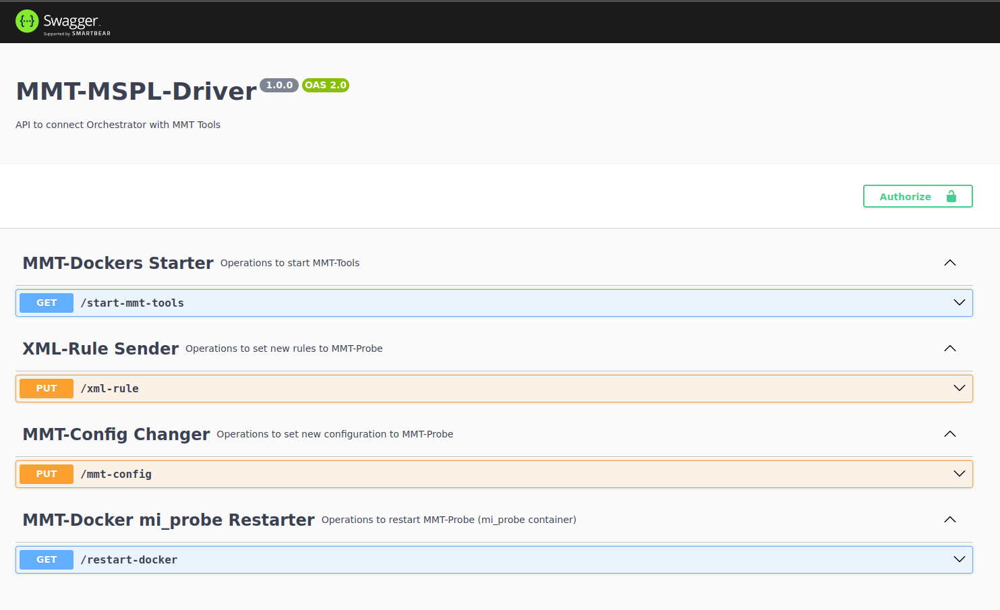

# About mmt-mspl-driver
This code exposes an API using NodeJs and npm to receive new mmt-probe.conf files and mmt-security rules to be applied in a running server. This code also has a Swagger descriptor at http://[IP]:3000/api-docs .



# Run the Project

Go to the project directory

```bash
  cd mmt-mspl-plugin
```

Install dependencies

```bash
  npm install
```

Start the server (must be done with sudo)

```bash
  sudo node index.js
```

# Run using Docker
```bash
sudo docker pull gustavojodar/mspl-enabler:mspl-driver

sudo docker run --name mspl-driver-container -p 4000:4000 --rm gustavojodar/mspl-enabler:mspl-driver
```

# Requirements
 - Python 3
 - Node v12.22.9
 - npm 8.5.1
